<a id="readme-top"></a>

<!-- PROJECT LOGO -->

<br />
<div align="center">
  <a href="https://github.com/M1KUAPP/Turn">
    <picture>
      <source media="(prefers-color-scheme: dark)" srcset="assets/pitch/readme-hero-dark.png">
      
    </picture>
  </a>

  <h3>Turn</h3>

  <p>
    An AAC iPhone app that listens to a conversation partner and suggests replies from the user's own saved phrases, so they can answer in time.
    <br />
    <a href="https://github.com/M1KUAPP/Turn/releases/latest"><strong>Try the Simulator build »</strong></a>
    &middot;
    <a href="eval/results.md">Evaluation</a>
    &middot;
    <a href="PRIVACY.md">Privacy notice</a>
    <br />
  </p>

[![TypeScript][typescript-badge]][typescript-url]
[![Swift][swift-badge]][swift-url]
[![React][react-badge]][react-url]
[![React Native][reactnative-badge]][reactnative-url]
[![Expo][expo-badge]][expo-url]
[![Bun][bun-badge]][bun-url]
[![SQLite][sqlite-badge]][sqlite-url]
[![RevenueCat][revenuecat-badge]][revenuecat-url]
[![Cloudflare Workers][cloudflareworkers-badge]][cloudflareworkers-url]
[![Vitest][vitest-badge]][vitest-url]
[![Prettier][prettier-badge]][prettier-url]

</div>

<!-- TABLE OF CONTENTS -->

## Table of Contents

<details>
  <summary>Expand</summary>
  <ol>
    <li>
      <a href="#about-the-project">About The Project</a>
      <ul>
        <li><a href="#screenshots">Screenshots</a></li>
        <li><a href="#how-it-works">How It Works</a></li>
        <li><a href="#features">Features</a></li>
        <li><a href="#architecture">Architecture</a></li>
        <li><a href="#tech-stack">Tech Stack</a></li>
      </ul>
    </li>
    <li>
      <a href="#getting-started">Getting Started</a>
      <ul>
        <li><a href="#prerequisites">Prerequisites</a></li>
        <li><a href="#installation">Installation</a></li>
      </ul>
    </li>
    <li><a href="#roadmap">Roadmap</a></li>
    <li><a href="#team">Team</a></li>
    <li><a href="#license">License</a></li>
    <li><a href="#acknowledgments">Acknowledgments</a></li>
  </ol>
</details>

<!-- ABOUT THE PROJECT -->

## About The Project

Your own words, in time for your turn. Turn is an augmentative and alternative communication (AAC) app for iPhone, for adults who can read and tap but can't rely on their speech, such as people living with ALS or recovering from a stroke. It speaks their saved phrases and typed words aloud. In Listen mode, when a conversation partner finishes speaking, a row above the grid offers the person's own saved phrases that answer what was said, so they can reply before the conversation moves on.

A hosted decision model chooses which of the person's phrases answer each line, and whether any do. It never writes a word, and nothing speaks until the person taps. Speaking is always free; Turn Listen, a one-time purchase through RevenueCat, keeps Listen mode on after 20 free partner lines. Turn was built for RevenueCat's Shipaton 2026.

On September 23, 2026, at commit [`8ea25eb`](https://github.com/M1KUAPP/Turn/commit/8ea25eb), the team evaluated 80 partner lines with the hosted decision model pinned to version 1.13.0. On the 64 lines with an acceptable saved reply besides Yes, No, and Not sure:

| Ranker                | Top 1                        | Top 6                      | Mean reciprocal rank |
| --------------------- | ---------------------------- | -------------------------- | -------------------- |
| chance                | 5%                           | 26%                        | 0.15                 |
| place                 | 1 of 64, 1.6% (0.3% to 8.3%) | 8 of 64, 13% (6.5% to 23%) | 0.06                 |
| keyword               | 10 of 64, 16% (8.7% to 26%)  | 15 of 64, 23% (15% to 35%) | 0.19                 |
| embeddings            | 14 of 64, 22% (14% to 33%)   | 29 of 64, 45% (34% to 57%) | 0.34                 |
| hosted decision model | 43 of 64, 67% (55% to 77%)   | 48 of 64, 75% (63% to 84%) | 0.72                 |

The hosted decision model's top 6 leads embeddings by 29.7 points, with a 95% paired interval of 17.2 to 42.2. Claude subagents wrote the lines, the starter bank, and the acceptable-reply labels at the team's direction. When it ran, no teammate had read the bank or labeled a line, and no clinic had reviewed the bank; text a language model wrote or labeled may suit a ranker built on one. The [evaluation report](eval/results.md) has the intervals, the row's risk and coverage, latency, and who wrote what.

<p align="right"><a href="#readme-top">&uarr;</a></p>

### Screenshots

<table>
  <tr>
    <td width="33%" valign="top" align="left">
      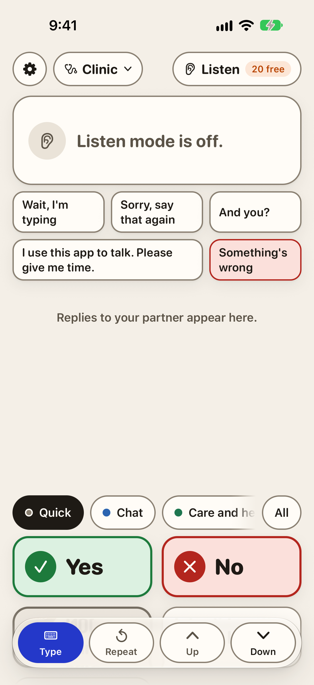
      <br />
      <strong>Speaking grid</strong> · The Clinic grid of saved phrases, with the conversation strip and floating toolbar.
    </td>
    <td width="33%" valign="top" align="left">
      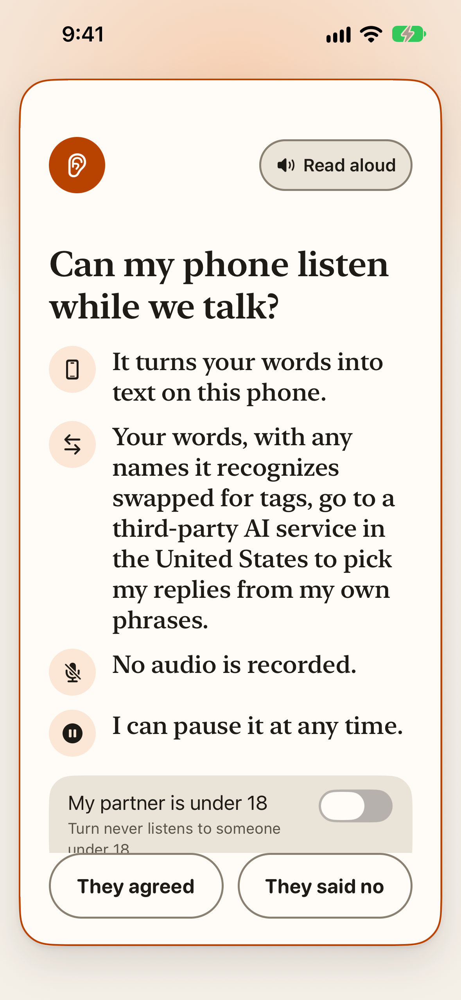
      <br />
      <strong>Partner consent</strong> · The consent card the partner sees each time listening starts, with an under-18 switch.
    </td>
    <td width="33%" valign="top" align="left">
      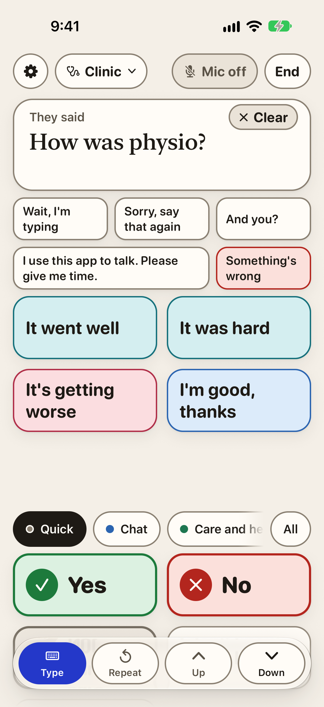
      <br />
      <strong>Suggested replies</strong> · Saved phrases that answer what the partner said, in a row above the grid.
    </td>
  </tr>
  <tr>
    <td width="33%" valign="top" align="left">
      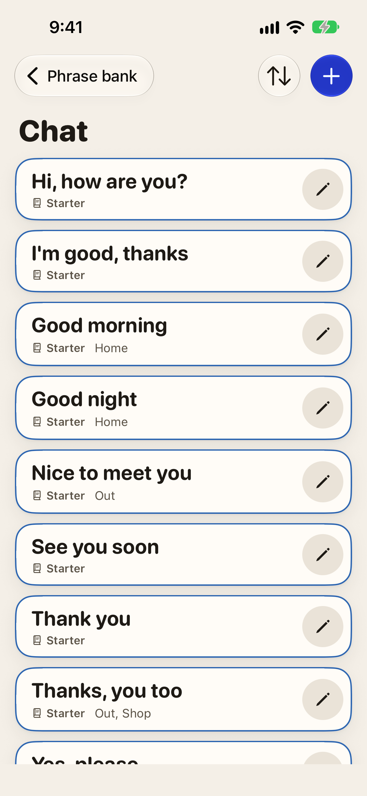
      <br />
      <strong>Phrase bank editor</strong> · A category's starter phrases, with buttons to edit, reorder, or add phrases.
    </td>
    <td width="33%" valign="top" align="left">
      
      <br />
      <strong>Turn Listen paywall</strong> · A one-time purchase that keeps Listen mode on after 20 free partner lines.
    </td>
    <td width="33%" valign="top" align="left">
      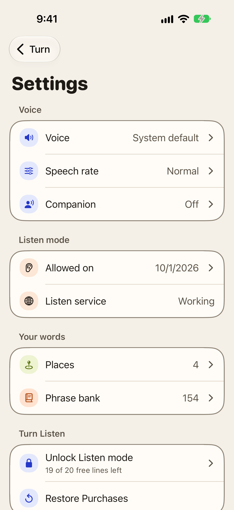
      <br />
      <strong>Settings</strong> · Voice and speech rate, companion, Listen service status, places, phrase bank, and purchases.
    </td>
  </tr>
  <tr>
    <td width="33%" valign="top" align="left">
      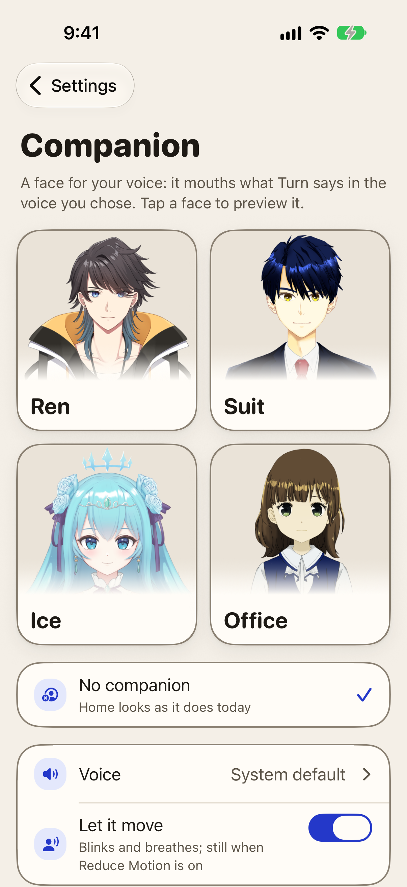
      <br />
      <strong>Choose a companion</strong> · Choose Ren, Suit, Office, or Ice, and whether the face moves.
    </td>
    <td width="33%" valign="top" align="left">
      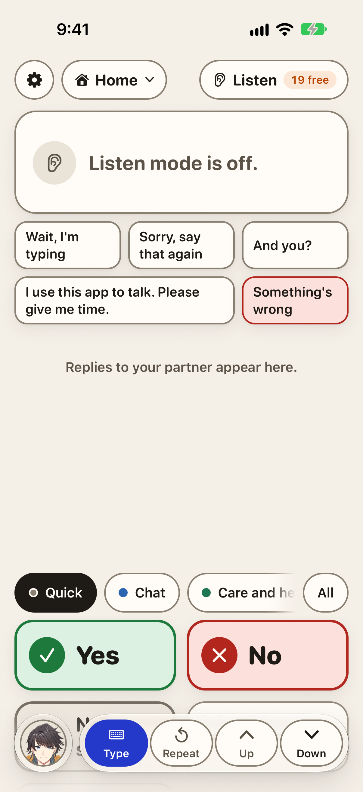
      <br />
      <strong>Home with Ren</strong> · Ren sits beside the floating toolbar and mouths what Turn says.
    </td>
    <td width="33%" valign="top" align="left">
      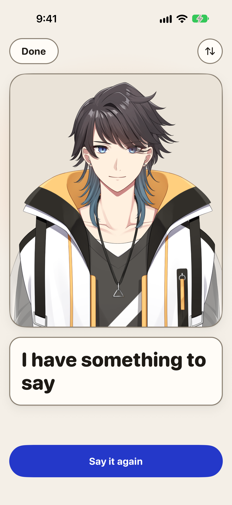
      <br />
      <strong>Partner view</strong> · Tapping the face shows your line in big text, with Say it again.
    </td>
  </tr>
</table>

<p align="right"><a href="#readme-top">&uarr;</a></p>

### How It Works

The steps below follow the Simulator build, where the partner's line is typed; on an iPhone, Turn can also transcribe the partner's speech.

1. **Pick a place.** On first launch, tap **Review** to edit the starter phrases, or **Not now** to try them as supplied. The speaking grid has about 150 phrases in categories. Tap **Home** at the top of the grid and choose **Clinic**.

   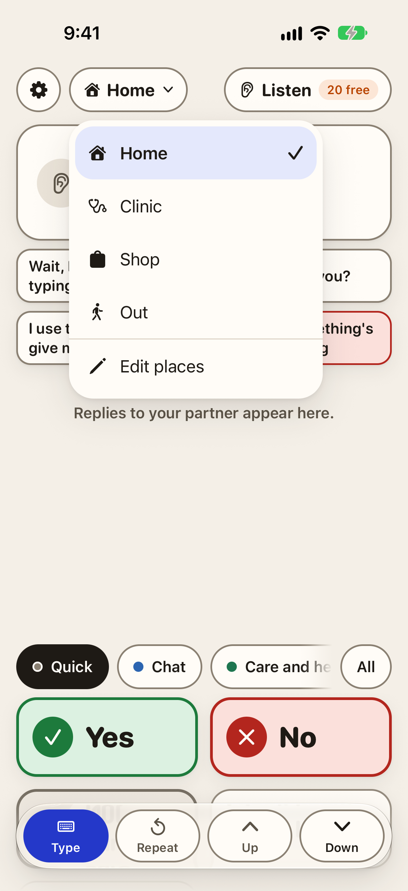

2. **Speak.** Tap any phrase to hear it in a system voice or your Personal Voice. Tap **Type** to speak typed words, which join the phrase bank. If iOS shows its typing tutorial, tap **Continue**.

   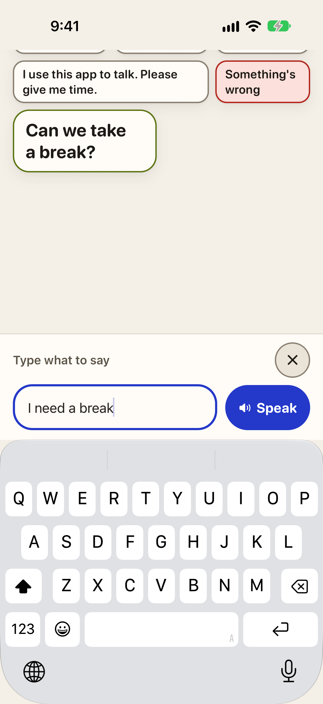

3. **Start Listen mode.** Tap **Listen**, then **Allow** to let Turn send your phrases and the partner's words to the hosted decision model. Show the partner the consent card and tap **They agreed**.

   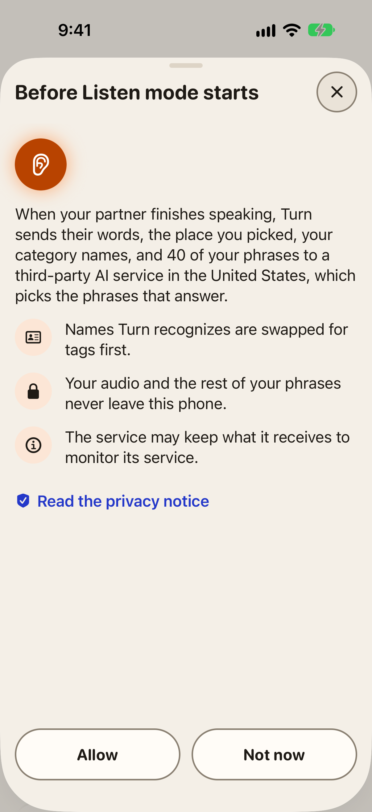

4. **Answer.** Tap **Tap here to type what they say.**, enter "How was physio?", and tap **Send**. "It was hard" appears in the row of suggested replies, though the two share no content word. Tap it to say it; **Repeat** changes to **Stop** while Turn speaks.

   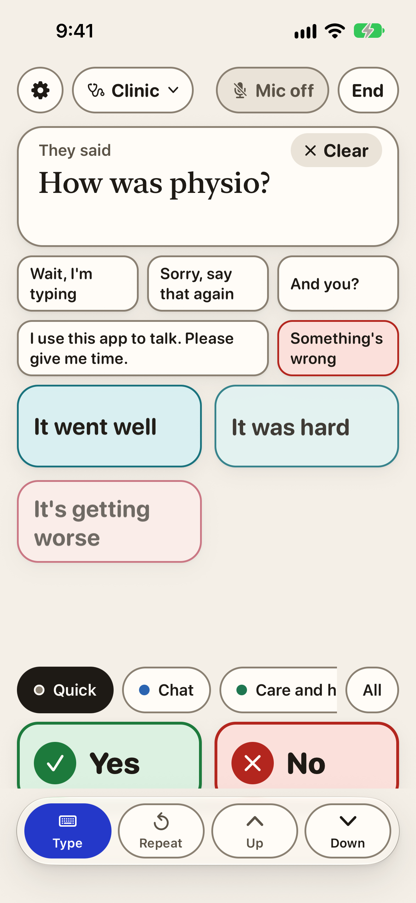

5. **Keep listening.** Listen mode answers 20 partner lines for free; the 21st opens the Turn Listen paywall. To buy it, open **Settings**, tap **Unlock Listen mode**, and complete the purchase in RevenueCat's Test Store. **Restore Purchases** in Settings refreshes the status after a reinstall.

   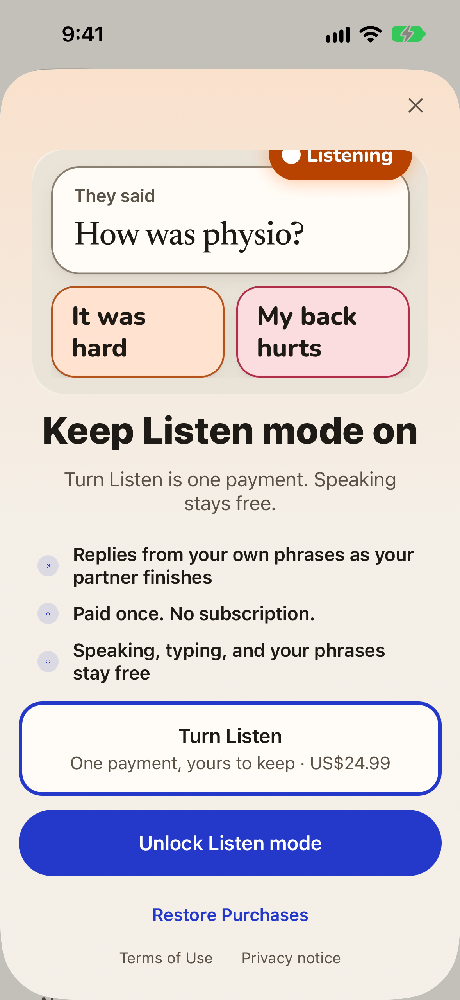

For a face beside the toolbar, open **Settings → Companion** and choose Ren, Suit, Office, or Ice. Tap the face after speaking to show the partner your line in big text with **Say it again**.

<p align="right"><a href="#readme-top">&uarr;</a></p>

### Features

- **A speaking grid of your own words.** Saved phrases in categories you can rename and reorder, about 150 editable starter phrases, and typed replies that join the bank.
- **Your voice.** Speaks in your Personal Voice, if you made one in iOS, or a system voice.
- **Replies from what the partner said.** One big button when Turn is confident, up to six replies otherwise, and no change when nothing fits. Yes, No, and Not sure come first for a yes-or-no question and always keep their places.
- **A steady row.** A reply keeps its slot until a new one wins by a clear margin, and the grid never reorders itself.
- **A conversation strip.** Five fixed phrases that manage the conversation, such as "Wait, I'm typing" and "Sorry, say that again".
- **A face for your voice.** In **Settings → Companion**, choose Ren, Suit, Office, or Ice; the companion is Off by default. Beside the toolbar, the face mouths what Turn says, looks up while the partner’s words arrive, and looks down while you type.
- **A view for the partner.** Tap the face to show the spoken line in big text with **Say it again**. In each place’s sheet, **Show the face here** turns the face on or off for that place.
- **A face that moves with you.** The live Live2D face breathes and its hair follows its physics when **Let it move** is on and Reduce Motion is off. Otherwise, it holds still.
- **Listening that's agreed and visible.** Your permission before any phrase leaves the phone, the partner's consent card each time listening starts, a light while it listens, and a switch that keeps a partner under 18 from being heard.
- **Private by default.** No accounts. The phrase bank stays on the phone, names become tags before a line leaves it, and no audio is recorded. The [privacy notice](PRIVACY.md) is also in the app, under **Settings** and **About**.
- **Useful offline.** Without a network, or when the model service is slow or down, the phone ranks phrases itself and says Listen mode is degraded.
- **Speech is never sold.** The grid, typing, saved phrases, and Personal Voice are free; Turn Listen is sold once.

<p align="right"><a href="#readme-top">&uarr;</a></p>

### Architecture

<picture>
  <source media="(prefers-color-scheme: dark)" srcset="assets/readme/architecture-dark.svg">
  
</picture>

A partner's line becomes text on the iPhone, through Apple's SpeechAnalyzer or, where it isn't available, Expo's speech recognition. The app picks a shortlist of 40 phrases from the bank, swaps names for tags, and posts the line to the relay. The relay checks the request and a per-address rate limit, then the user's Durable Object counts the line, checks the `listen` entitlement with RevenueCat once the 20 free lines are used, and asks the hosted decision model to score the shortlist. When the relay fails or is switched off, the app ranks the shortlist on the phone.

The diagram was made with [archify](https://github.com/tt-a1i/archify) and tinted with Turn's color tokens.

<p align="right"><a href="#readme-top">&uarr;</a></p>

### Tech Stack

- **App:** Expo SDK 57, React Native 0.86, React 19.2, TypeScript, Expo Router, expo-sqlite, expo-speech, and expo-speech-recognition.
- **Native modules:** Swift Expo modules for on-device transcription with SpeechAnalyzer ([`turn-listen`](modules/turn-listen)) and Personal Voice ([`turn-voice`](modules/turn-voice)).
- **Purchases:** RevenueCat's `react-native-purchases` and `react-native-purchases-ui`, with the Test Store, and its REST API v2 on the relay.
- **Relay:** a Cloudflare Worker with SQLite-backed Durable Objects, in [`worker`](worker).
- **Shared code:** the shortlist and the relay's types in [`shared`](shared), with MiniSearch for the phone's own ranking.
- **Evaluation:** Bun scripts in [`eval`](eval), with Workers AI embeddings and Apple's sentence embeddings through Swift.
- **Tooling:** Bun workspaces, Vitest, Prettier, Husky with commitlint, and Maestro flows.

<p align="right"><a href="#readme-top">&uarr;</a></p>

<!-- GETTING STARTED -->

## Getting Started

Install the Simulator build to try Turn, or build it from source. Live transcription needs a physical iPhone; the Simulator build takes typed partner lines.

<p align="right"><a href="#readme-top">&uarr;</a></p>

### Prerequisites

- Turn runs on iOS 26+.
- A Mac with Xcode 27 and the iOS 27 Simulator runtime.
- To build from source: [Bun](https://bun.sh) 1.4.2 and CocoaPods.
- To run your own relay: a Cloudflare account, a RevenueCat project with a `listen` entitlement, and an API key for the hosted decision model.
- To run the evaluation: the hosted decision model's key, Cloudflare Workers AI credentials, and Swift.

<p align="right"><a href="#readme-top">&uarr;</a></p>

### Installation

1. **The Simulator build.** Download `Turn.app.zip` from the [latest release](https://github.com/M1KUAPP/Turn/releases/latest), boot an iOS 27 Simulator, and install it. It embeds its JavaScript, so it runs without Metro.

   ```shell
   unzip Turn.app.zip
   xcrun simctl install booted Turn.app
   xcrun simctl launch booted com.m1ku.turn
   ```

2. **From source.** Clone the repository, install, and run the app on a Simulator. Leave Metro running.

   ```shell
   git clone https://github.com/M1KUAPP/Turn.git
   cd Turn
   bun install --frozen-lockfile
   cd app
   bun run ios
   ```

   For a physical iPhone, set `EXPO_PUBLIC_BUILD_KIND=device` and run `bunx expo run:ios --device`, with your own signing team.

3. **With your own keys.** The app is configured with the team's public Test Store key and relay. To use your own, copy [`worker/.dev.vars.example`](worker/.dev.vars.example) to `worker/.dev.vars`, fill in its three secrets, and set your RevenueCat project and entitlement IDs in [`worker/wrangler.jsonc`](worker/wrangler.jsonc). Then start the relay:

   ```shell
   cd worker
   bunx wrangler dev --port 8787
   ```

   In [`app/.env`](app/.env.example), set `EXPO_PUBLIC_RELAY_URL=http://localhost:8787` and your public Test Store key, then build the app as above. Secret keys stay in the relay.

4. **The evaluation.** Set the environment variables that [`eval/src/report.ts`](eval/src/report.ts) documents, then run it from a clean commit. It makes paid model calls and writes a report with its plots.

   ```shell
   bun run eval --unnamed --out eval/your-results.md
   ```

Run `bun run test` and `bun run typecheck` from the repository root to check a change.

<p align="right"><a href="#readme-top">&uarr;</a></p>

<!-- ROADMAP -->

## Roadmap

See [open issues](https://github.com/M1KUAPP/Turn/issues) for a full list of proposed features (and known issues).

<p align="right"><a href="#readme-top">&uarr;</a></p>

<!-- CONTRIBUTING -->

## Team

<a href="https://github.com/M1KUAPP/Turn/graphs/contributors">
  
</a>

Made with [contrib.rocks](https://contrib.rocks).

<p align="right"><a href="#readme-top">&uarr;</a></p>

<!-- LICENSE -->

## License

See [LICENSE](LICENSE) for more information.

<p align="right"><a href="#readme-top">&uarr;</a></p>

<!-- ACKNOWLEDGMENTS -->

## Acknowledgments

- [RevenueCat Shipaton 2026](https://www.shipaton.com)
- [archify](https://github.com/tt-a1i/archify)
- [Atkinson Hyperlegible Next](https://www.brailleinstitute.org/freefont/), the font in the banner ([OFL](assets/pitch/fonts/OFL.txt))
- The companion's faces, drawn with Live2D: Ren is Ren Foster, © Live2D Inc., under the Live2D Free Material License; Suit and Office are Suit Male and Office Girl by Ooie; and Ice is Ice Girl, "Live2D: @TianYeLulu"
- [Live2D Cubism SDK for Web](https://www.live2d.com/en/sdk/about/), which draws the live companion: Cubism Core under the Live2D Proprietary Software License, and the Cubism Framework under the Live2D Open Software License
- [Shields.io](https://shields.io)
- [contrib.rocks](https://contrib.rocks)

<p align="right"><a href="#readme-top">&uarr;</a></p>

<!-- MARKDOWN LINKS & IMAGES -->

[typescript-badge]: https://img.shields.io/badge/TypeScript-3178C6?style=for-the-badge&logo=typescript&logoColor=white
[typescript-url]: https://www.typescriptlang.org/
[swift-badge]: https://img.shields.io/badge/Swift-F05138?style=for-the-badge&logo=swift&logoColor=white
[swift-url]: https://www.swift.org/
[react-badge]: https://img.shields.io/badge/React-61DAFB?style=for-the-badge&logo=react&logoColor=black
[react-url]: https://react.dev/
[reactnative-badge]: https://img.shields.io/badge/React_Native-61DAFB?style=for-the-badge&logo=react&logoColor=black
[reactnative-url]: https://reactnative.dev/
[expo-badge]: https://img.shields.io/badge/Expo-1C2024?style=for-the-badge&logo=expo&logoColor=white
[expo-url]: https://expo.dev/
[bun-badge]: https://img.shields.io/badge/Bun-000000?style=for-the-badge&logo=bun&logoColor=white
[bun-url]: https://bun.sh/
[sqlite-badge]: https://img.shields.io/badge/SQLite-003B57?style=for-the-badge&logo=sqlite&logoColor=white
[sqlite-url]: https://www.sqlite.org/
[revenuecat-badge]: https://img.shields.io/badge/RevenueCat-F2545B?style=for-the-badge&logo=revenuecat&logoColor=white
[revenuecat-url]: https://www.revenuecat.com/
[cloudflareworkers-badge]: https://img.shields.io/badge/Cloudflare_Workers-F38020?style=for-the-badge&logo=cloudflareworkers&logoColor=white
[cloudflareworkers-url]: https://workers.cloudflare.com/
[vitest-badge]: https://img.shields.io/badge/Vitest-00FF74?style=for-the-badge&logo=vitest&logoColor=white
[vitest-url]: https://vitest.dev/
[prettier-badge]: https://img.shields.io/badge/Prettier-F7B93E?style=for-the-badge&logo=prettier&logoColor=black
[prettier-url]: https://prettier.io/
