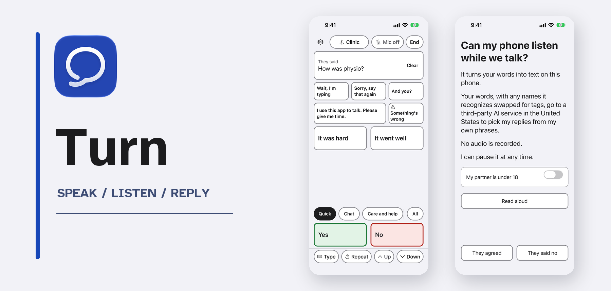
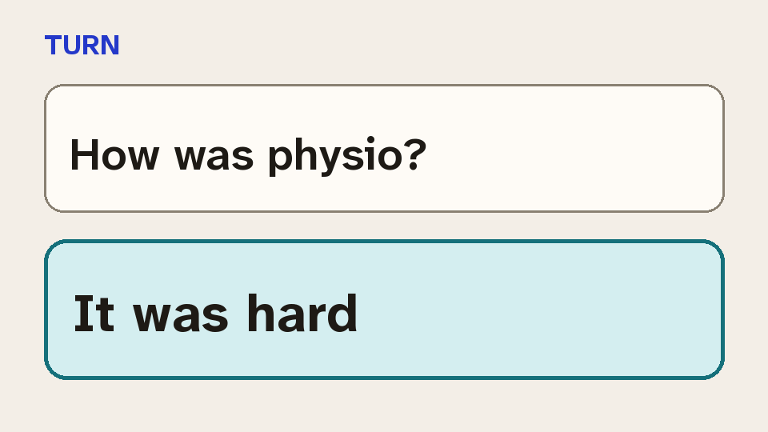
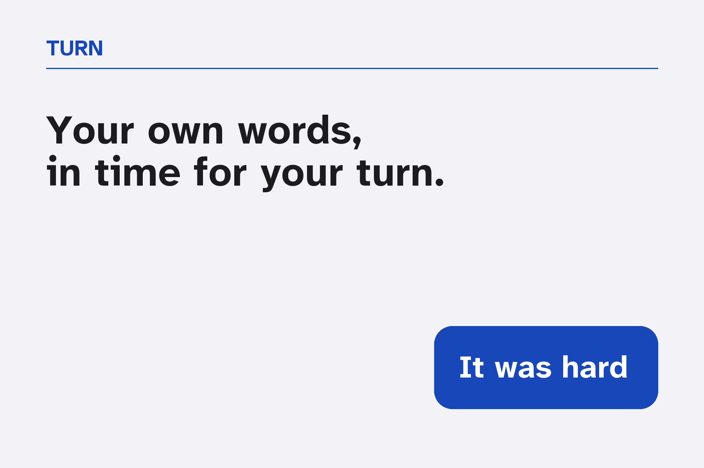
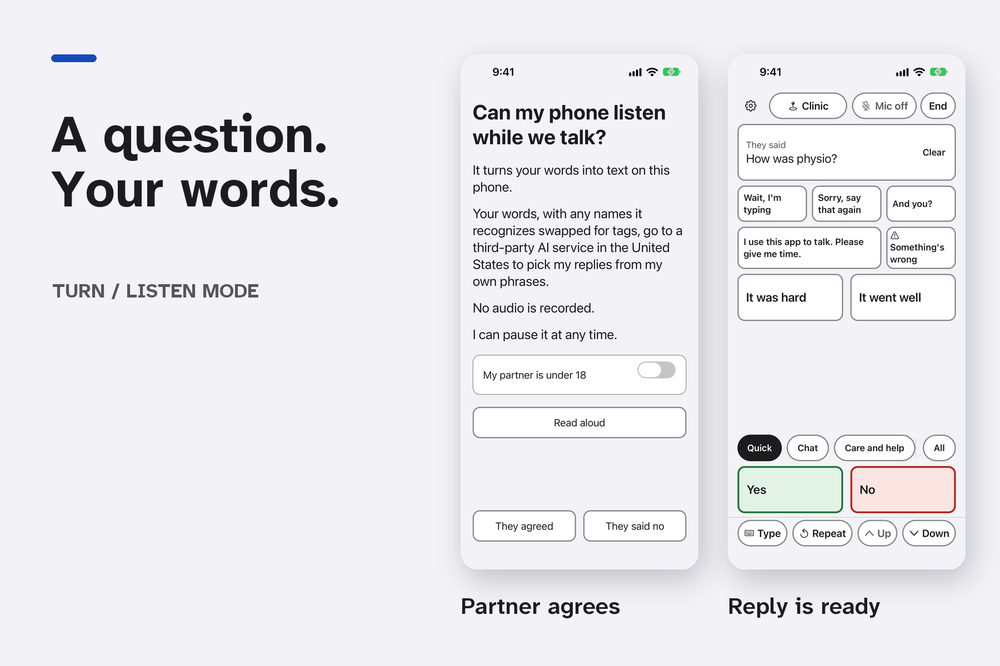
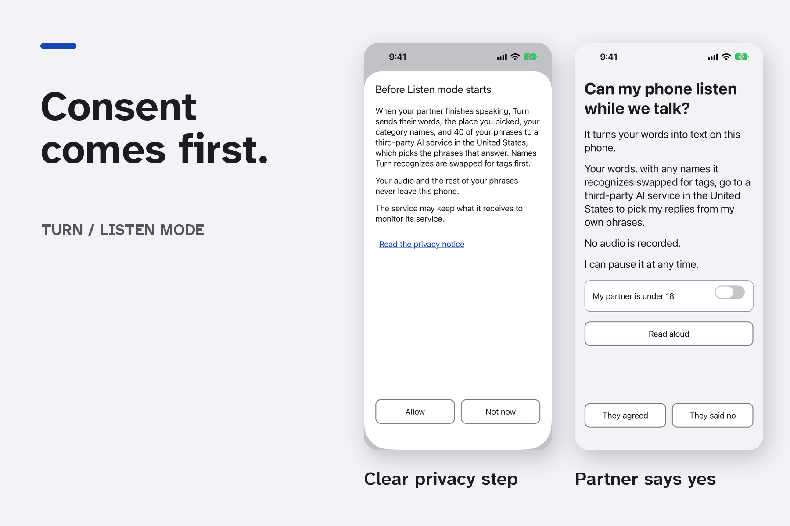

# Turn pitch assets

The [Icon Composer source](/app/assets/turn.icon/icon.json) has separate vector
field and mark layers. The [1024-pixel icon](/assets/pitch/turn-icon-1024.png)
is its flattened default export; [dark](/assets/pitch/turn-icon-dark-1024.png)
and [tinted](/assets/pitch/turn-icon-tinted-1024.png) exports are here too.

## README images

<picture>
  <source media="(prefers-color-scheme: dark)" srcset="../assets/pitch/readme-hero-dark.png">
  
</picture>

Your own words, in time for your turn.

The logline is text so it remains readable and selectable. The GIF's first
frame shows both the question and answer when animation is paused. When the
[README draft](https://github.com/RevenueCat-M1KU/RevenueCat/pull/119) lands,
copy this `<picture>` and GIF into the repository README, changing `../assets`
to `assets` in their paths.

## Devpost images

The [required portrait screenshot](/assets/pitch/turn-iphone16-ios27.png) is
1179 by 2556 pixels, captured without a device frame on the iPhone 16 iOS 27
Simulator with a 9:41 status bar. Its caption and replies are actual app UI.
For this controlled capture, a local relay mock scored two existing saved
phrases after they were tapped in the Clinic bank.

Run `python3 scripts/render-pitch-assets.py` with Pillow installed to rebuild
the thumbnail, gallery images, README heroes, and GIF from the committed
Simulator captures and Atkinson Hyperlegible Next font. The font's OFL license
is in [`assets/pitch/fonts/OFL.txt`](/assets/pitch/fonts/OFL.txt).
